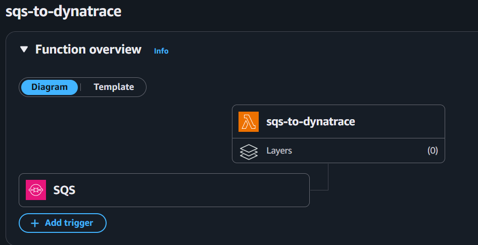
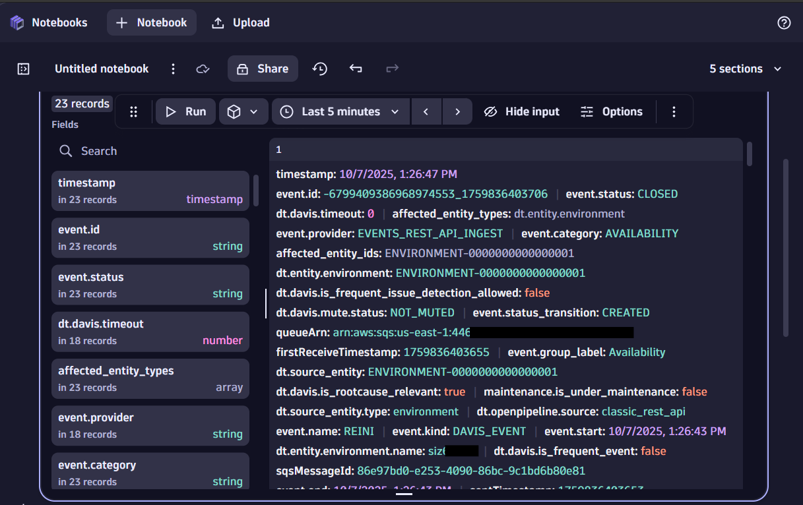

# Dynatrace SQS Event Forwarder


This Lambda solution forwards messages from **Amazon SQS** queues to the **Dynatrace Events API** — converting queue messages into Dynatrace events and enriching them with SQS metadata.  

It enables seamless integration between AWS and Dynatrace, allowing you to automatically surface operational signals, error notifications, or DLQ entries from your SQS queues as Dynatrace events for observability and alerting.

---

## 🚀 Deployment

Deployment is handled entirely through **Terraform** using the configuration provided in this repository.

### Prerequisites

Before applying Terraform:
- Have a working **AWS account** and credentials configured.
  - > See [🔑 AWS Credentials](#-aws-credentials) for setup instructions if you haven’t used Terraform with AWS before.
- Have a **Dynatrace environment** and an **API token** with the `events.ingest` permission.
- Have the [Terraform CLI installed](https://developer.hashicorp.com/terraform/tutorials/aws-get-started/install-cli#install-terraform) on your workstation
- Ensure you can access the repo’s **Terraform configuration** (contains the Lambda deployment logic).

### Variables to set

| Variable | Description | Example |
|-----------|--------------|----------|
| `aws_region` | AWS region to deploy the Lambda | `us-east-1` |
| `function_name` | Name of the Lambda function | `sqs-to-dynatrace` |
| `queue_arn` | ARN of the SQS queue to subscribe | `arn:aws:sqs:us-east-1:123456789012:my-queue` |
| `dt_url` | Dynatrace environment URL | `https://abc123.live.dynatrace.com` |
| `dt_token` | Dynatrace API token (events.ingest) | `dt0c01.abc…` |
| `github_token` | *(Optional)* A GitHub Token to avoid rate limitations | `github_pat_11BK...` |

### 🪪 About `github_token`

The `github_token` is **optional**, but **recommended**:

- If the GitHub repository is **public**, Terraform can fetch the latest release **without a token**.  
  However, unauthenticated requests are **rate-limited** (typically 60/hour per IP).  
  Providing a token avoids those limits.

- If the repository is **private**, the token is **required** so Terraform can access releases and download the Lambda ZIP.

You can create a **Personal Access Token (fine-grained or classic)** in your [GitHub Developer Settings](https://github.com/settings/tokens).  
It only needs **read access** to repository contents (for example, “Contents: Read”).  

> If you omit it, Terraform will still work for public repos — but may eventually hit rate limits.


## 🧩 Configure Terraform variables
* Copy `infra/terraform/terraform.tfvars.example` from this repo to `infra/terraform/terraform.tfvars`.
* Open `infra/terraform/terraform.tfvars` and update all required variables with your own values.

> 🛡️ **Tip:** Your Dynatrace token is only stored locally by Terraform during deployment — don’t commit your `terraform.tfvars` file to version control.

## 🚀 Deploy the Lambda function

Within the folder `infra/terraform/` then run:
```bash
terraform init
terraform apply -auto-approve
```

> ℹ️ If Terraform prints a “Response body is not recognized as UTF-8” warning, you can safely ignore it — the download contains binary data (the Lambda ZIP file).

Terraform automatically:
- Downloads the **latest release artifact** (`function-vX.Y.Z.zip`) from GitHub.
- Creates or updates **and** configures the Lambda function via Environment Variables.
- Subscribes it to the specified SQS queue.



## ✅ Verify the deployment

1. Open the **AWS Lambda console** → select your function.  
   - Confirm the **SQS trigger** is listed under *Triggers*.
   - Check that environment variables include your Dynatrace configuration.

2. Send a test message to your SQS queue:
   ```bash
   aws sqs send-message \
     --queue-url https://sqs.us-east-1.amazonaws.com/123456789012/my-queue \
     --message-body "Hello from test!"
    ```
   
   > 🛡️ **Tip:** You can also send test messages from within the AWS Console.


3. Within seconds, check Dynatrace → Events and verify that a new event appears



---

## ⚙️ Lambda Behavior

Once deployed, any message arriving in your queue will be automatically transformed and sent to Dynatrace as an event — enriched with full SQS context and ready for analysis in your dashboards and alerting workflows.

### 1. Raw messages (text)
If an SQS message body is **plain text**, it is sent to Dynatrace as a new event:

| Field | Value |
|--------|--------|
| **Title** | Message body (truncated if necessary) |
| **Event type** | `AVAILABILITY_EVENT` (default) |
| **Properties** | Includes queue ARN, message ID, and receive count |

### 2. Event JSON messages
If the message body is already a **valid Dynatrace event JSON**, the Lambda forwards it directly — only adding metadata.

The function:
- **Preserves** your title, event type, and properties.
- **Adds** queue information (`queueArn`, `messageId`, etc.).
- **Adds** timing fields (`startTime`, `endTime`) if missing.

### 3. DLQ messages
If the Lambda is subscribed to a **Dead Letter Queue (DLQ)**:
- It automatically detects this and prefixes event titles with **`[DLQ]`**.
- The forwarded event includes `properties.originalQueue` when available.

If you include a property or SQS message attribute (default key: `originalQueueArn`) that identifies the original queue, the Lambda will also include it in the event metadata.

💡Your Lambda function allows for reconfiguring the key `originalQueueArn`.

---

## 🧠 Message Processing Summary

| Scenario | Behavior | Dynatrace Event Title |
|-----------|-----------|-----------------------|
| Plain text body | Creates a new Dynatrace event | Message content |
| JSON body (not event format) | Creates new Dynatrace event | JSON as string |
| Dynatrace event JSON body | Forwards as-is with enrichment | Existing `title` |
| DLQ message | Adds `[DLQ]` prefix to title | `[DLQ] …` |

All events are enriched with:
- Queue ARN
- Message ID
- Approximate receive count
- Timestamps
- (Optional) Original queue ARN

---

## 🔐 Permissions

Terraform attaches an IAM role granting:
- Lambda execution (`logs:*`)
- SQS read and delete (`ReceiveMessage`, `DeleteMessage`, etc.)
- DLQ inspection (`ListDeadLetterSourceQueues`)

---

## 🪵 Logging

Lambda writes diagnostic logs to **Amazon CloudWatch**.

When the `DEBUG` environment variable is set to `true`, each outgoing Dynatrace payload is printed before sending.

---

## 💡 Example Use Cases

| Use Case | Description |
|-----------|--------------|
| **Forward operational alerts** | Forward application or infrastructure alerts as Dynatrace events for correlation. |
| **Monitor DLQs** | Trigger Dynatrace events whenever a message lands in a DLQ. |
| **Integrate external systems** | Push system events to SQS from other services, and automatically surface them in Dynatrace. |

---

## 🧰 Configuration Reference

| Environment Variable | Description | Default |
|-----------------------|--------------|----------|
| `DT_URL` | Dynatrace environment URL | — |
| `DT_TOKEN` | Dynatrace API token | — |
| `DT_ENTITY_SELECTOR` | Default entity selector | |
| `DT_EVENT_TYPE` | Default event type for raw messages | `AVAILABILITY_EVENT` |
| `DT_TIMEOUT_MS` | Auto-close timeout in ms | `0` |
| `DT_TITLE_MAX` | Max title length | `500` |
| `DT_ORIGINAL_QUEUE_PROP` | Key for original queue (in body or attributes) | `originalQueueArn` |
| `DT_DLQ_PREFIX` | Prefix for DLQ event titles | `[DLQ]` |
| `DEBUG` | Enables verbose logs | unset |

---

## 🧹 Cleanup

To remove all deployed resources, run:
```bash
terraform destroy -auto-approve
```

## 🔑 AWS Credentials

Terraform (and the AWS provider) automatically looks for your AWS credentials in several standard locations.  
You don’t need to configure anything special unless your setup is non-standard.

### Default credential lookup order

1. **Environment variables**  
   ```bash
   export AWS_ACCESS_KEY_ID=AKIA...
   export AWS_SECRET_ACCESS_KEY=abcd...
   export AWS_DEFAULT_REGION=us-east-1
   ```
   *(Recommended for local use or CI/CD pipelines.)*

2. **Shared credentials/config files** (used by the AWS CLI)  
   ```
   ~/.aws/credentials
   ~/.aws/config
   ```
   Example:
   ```ini
   [default]
   aws_access_key_id = AKIA...
   aws_secret_access_key = abcd...
   region = us-east-1
   ```

3. **AWS CLI SSO / Named Profiles**  
   If you use SSO or multiple accounts:
   ```bash
   aws sso login --profile myprofile
   export AWS_PROFILE=myprofile
   ```
   Terraform will automatically use the profile specified by `AWS_PROFILE`.

4. **Instance/Container Roles**  
   When running inside AWS (e.g., Cloud9, EC2, ECS, or GitHub Actions with OIDC),  
   Terraform automatically uses the environment’s IAM role credentials.


### 💡 Tips

- Test your credentials before running Terraform:
  ```bash
  aws sts get-caller-identity
  ```
  This command confirms you’re authenticated and shows the account and user/role.

- Avoid committing credentials or access keys to Git.
- Use named profiles (`AWS_PROFILE`) for multiple accounts or roles.
- In CI/CD, prefer **temporary credentials** or **OIDC federation** over static keys.

---

## ✅ Summary

| Feature | Description |
|----------|--------------|
| **Raw messages → Events** | Converts SQS text into Dynatrace events |
| **Event JSON passthrough** | Forwards existing event JSON unchanged |
| **DLQ detection** | Prefixes title and enriches metadata |
| **Terraform deployment** | Uses latest GitHub release automatically |
| **No build required** | Prebuilt binary is downloaded for you |

## ❓ FAQ

**Q:** Do I need to build or compile anything?  
**A:** No. Terraform automatically downloads the prebuilt binary from the latest GitHub release.

**Q:** Am I required to use the prebuilt binaries?  
**A:** No. Just clone this repository, execute `make zip` and upload and configure your Lambda manually. Make sure to have Go installed locally for that.

**Q:** What happens if Dynatrace is temporarily unavailable?  
**A:** The Lambda invocation will fail, and SQS retries automatically according to your queue’s redrive policy.

**Q:** Can I use multiple queues?  
**A:** Yes, deploy separate Lambda instances for each queue you want to monitor.

---

## 📁 Repository structure

| Folder | Description |
|-----------|--------------|
| `infra/terraform/` | Terraform files for deployment |
| `cmd/lambda/` | Go source for the Lambda function (for reference only) |
| `tools/` | Go source for utilities for local building |
| `.github/workflows/` | CI/CD pipeline that builds and publishes Lambda ZIPs |
